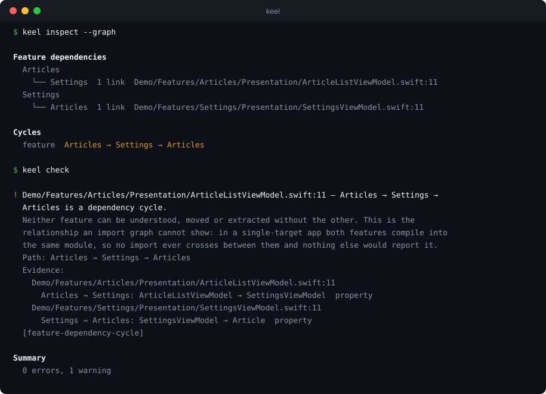
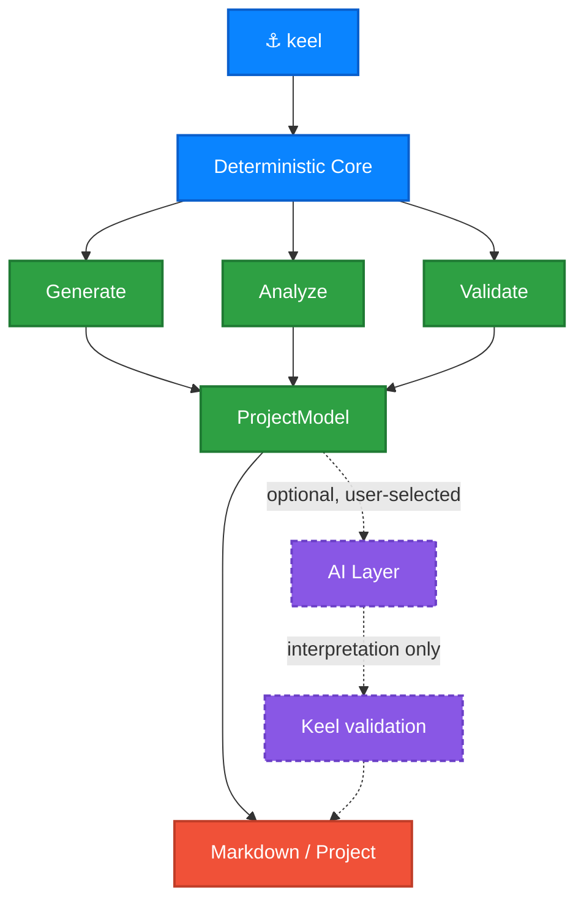

<div align="center">

# ⚓ Keel

### Create, understand, and maintain iOS projects from the terminal.

[](https://github.com/GRimAce11/Keel/actions)
[](https://swift.org)
[](https://developer.apple.com)
[](https://developer.apple.com)
[](LICENSE)

<samp>**No dependencies · Works offline · AI optional, never automatic**</samp>

</div>

---

> [!NOTE]
> **Early development.** The command surface below is complete and `keel new`
> configures a project interactively today. Project generation and the analysis
> commands are landing phase by phase — see the [roadmap](#-roadmap).

<br>

## ⚡ What it looks like

<div align="center">
  
</div>

<br>

## 🧭 Why Keel

Most iOS project templates are a folder you clone and immediately start
deleting from. Keel asks what you actually want and writes only that — a
project generated without networking contains no `APIClient.swift` to remove.

It then keeps working *after* the first commit: reading an existing project,
explaining its architecture, and validating it against its own rules.

<table>
<tr>
<td width="50%" valign="top">

#### 🔌 No dependencies
Not in Keel, and not in what it generates. No Alamofire, no Firebase, no DI
framework. `URLSession` and `async/await` are enough now, and a dependency you
never add is one you never migrate.

</td>
<td width="50%" valign="top">

#### 📴 Works offline
Templates are compiled into the binary, never fetched. Generation is
reproducible for a given Keel version and cannot fail on a network hiccup.

</td>
</tr>
<tr>
<td width="50%" valign="top">

#### 🤖 AI is optional
Every core command is deterministic. Keel works with no agent installed, no
account, no API key, and no network.

</td>
<td width="50%" valign="top">

#### 🔒 AI is never silent
Keel may *detect* installed agents, but never invokes one because it happens to
exist. Selection is always explicit; the default is always Keel alone.

</td>
</tr>
</table>

<br>

## 🏛 Architecture

Deterministic analysis is the foundation. An AI layer may *interpret* those
facts — it may never override them.



<br>

## 📟 Commands

| | Command | What it does | Status |
|:--:|---|---|:--:|
| 🆕 | `keel new` | Create a new iOS project | 🟡 Configuring |
| 📄 | `keel document` | Generate `PROJECT.md` from an existing project | ⚪ Planned |
| 🔍 | `keel inspect` | Report targets, schemes, dependencies | ⚪ Planned |
| ✅ | `keel check` | Validate a project against its architecture rules | ⚪ Planned |
| 🩺 | `keel doctor` | Diagnose the toolchain and project | ⚪ Planned |
| 🤖 | `keel ai` | Inspect and choose which local AI agent Keel may use | ⚪ Planned |

<br>

## 📦 Components

`keel new` asks about each of these independently. Say no and the files are
never written.

| Component | What you get |
|---|---|
| **Networking** | `APIClient`, endpoints, typed errors, retry and auth headers |
| **Dependency injection** | `AppContainer` composition root with constructor injection |
| **Persistence** | SwiftData model container and a store protocol |
| **Authentication** | Token storage, refresh, and sign-out on 401 |
| **Keychain storage** | Secure storage wrapping the Keychain API |
| **Localization** | String Catalog and typed accessors |
| **Unit tests** | Test target with stubs and ViewModel tests |
| **Design system** | Spacing, colour and typography tokens |
| **Example feature** | A working list + detail screen you can copy |

> [!TIP]
> Components that depend on others resolve automatically. `--no-networking`
> also drops authentication and the example feature — and says so, rather than
> emitting a project that does not compile.

<br>

## 🚀 Install

```bash
git clone https://github.com/GRimAce11/Keel.git
cd Keel
swift build -c release
cp .build/release/keel /usr/local/bin/
```

<sub>Requires macOS 13+. Homebrew distribution is planned.</sub>

<br>

## ⚙️ Usage

```bash
keel new MyApp                        # ask about each component
keel new MyApp --yes                  # take every default, for CI
keel new MyApp --minimal              # app skeleton only
keel new MyApp --no-networking        # skip one component
keel new MyApp --bundle-id com.acme --ios 18.0
```

<details>
<summary><b>All options</b></summary>

<br>

| Option | Effect |
|---|---|
| `--bundle-id <prefix>` | Bundle identifier prefix. The project slug is appended. |
| `--ios <version>` | Minimum iOS version. Defaults to `17.0`. |
| `-y, --yes` | Accept every default without asking. |
| `--minimal` | App skeleton only — no optional components. |
| `--no-networking` | Skip the networking layer. |
| `--no-dependency-injection` | Skip the DI container. |
| `--no-persistence` | Skip persistence. |
| `--no-authentication` | Skip authentication. |
| `--no-keychain` | Skip Keychain storage. |
| `--no-localization` | Skip localization. |
| `--no-testing` | Skip the unit test target. |
| `--no-design-system` | Skip the design system. |
| `--no-example-feature` | Skip the example feature. |

Names are normalised rather than rejected: `keel new "my cool app"` produces
`MyCoolApp` with the bundle slug `my-cool-app`. Swift keywords and names
starting with a digit are caught before anything is written.

</details>

<br>

## 🗺 Roadmap

<details>
<summary><b>Phase plan</b></summary>

<br>

| | Phase | |
|:--:|---|:--:|
| ✅ | CLI foundation | done |
| ✅ | Project configuration model | done |
| ✅ | Interactive `keel new` | done |
| ✅ | Template system | done |
| 🔨 | Xcode project generation | next |
| ⚪ | Generated MVVM architecture | |
| ⚪ | Conditional infrastructure modules | |
| ⚪ | Example feature | |
| ⚪ | `keel inspect` + ProjectModel | |
| ⚪ | Swift source & architecture analysis | |
| ⚪ | `keel document` without AI | |
| ⚪ | AI agent detection & provider abstraction | |
| ⚪ | AI-assisted documentation | |
| ⚪ | `keel check` and `keel doctor` | |
| ⚪ | `keel add feature` | |
| ⚪ | Homebrew distribution | |

</details>

<br>

## 🛠 Development

```bash
swift build
swift test
```

<br>

## 📄 License

MIT — the code Keel generates is yours, with no attribution required.

<div align="center">
<br>
<sub>Built by <a href="https://github.com/GRimAce11">Chethan Nayak</a></sub>
</div>
