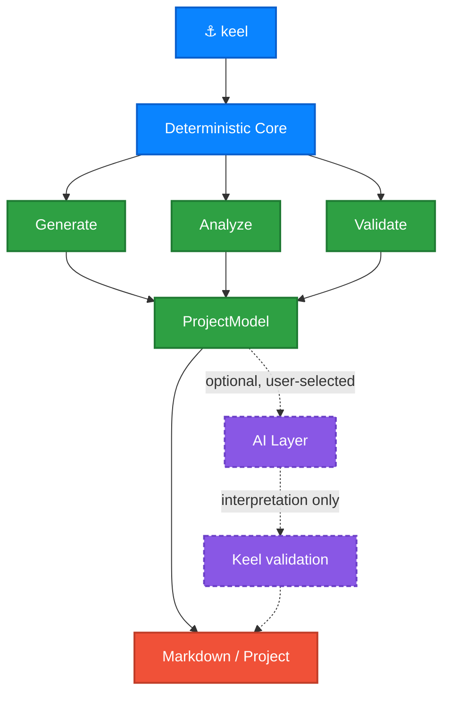

<div align="center">

# ⚓ Keel

### Create, understand, and maintain iOS projects from the terminal.

[](https://github.com/GRimAce11/Keel/actions)
[](https://swift.org)
[](https://developer.apple.com)
[](https://developer.apple.com)
[](LICENSE)

<samp>**No dependencies · Works offline · AI optional, never automatic**</samp>

</div>

---

> [!NOTE]
> **Early development.** `keel new`, `keel inspect` and `keel document` all
> work today. `check`, `doctor` and `ai` are declared but not implemented
> yet — see the [roadmap](#-roadmap).

<br>

## ⚡ What it looks like

<div align="center">
  
</div>

<br>

## 🧭 Why Keel

Most iOS project templates are a folder you clone and immediately start
deleting from. Keel asks what you actually want and writes only that — a
project generated without networking contains no `APIClient.swift` to remove.

It then keeps working *after* the first commit: reading an existing project,
explaining its architecture, and validating it against its own rules.

<table>
<tr>
<td width="50%" valign="top">

#### 🔌 No dependencies
Not in Keel, and not in what it generates. No Alamofire, no Firebase, no DI
framework. `URLSession` and `async/await` are enough now, and a dependency you
never add is one you never migrate.

</td>
<td width="50%" valign="top">

#### 📴 Works offline
Templates are compiled into the binary, never fetched. Generation is
reproducible for a given Keel version and cannot fail on a network hiccup.

</td>
</tr>
<tr>
<td width="50%" valign="top">

#### 🤖 AI is optional
Every core command is deterministic. Keel works with no agent installed, no
account, no API key, and no network.

</td>
<td width="50%" valign="top">

#### 🔒 AI is never silent
Keel may *detect* installed agents, but never invokes one because it happens to
exist. Selection is always explicit; the default is always Keel alone.

</td>
</tr>
</table>

<br>

## 🏛 Architecture

Deterministic analysis is the foundation. An AI layer may *interpret* those
facts — it may never override them.



<br>

## 📟 Commands

| | Command | What it does | Status |
|:--:|---|---|:--:|
| 🆕 | `keel new` | Create a new iOS project | ✅ Working |
| 📄 | `keel document` | Generate `PROJECT.md` from an existing project | ✅ Working |
| 🔍 | `keel inspect` | Report targets, schemes, dependencies, architecture | ✅ Working |
| ✅ | `keel check` | Validate a project against its architecture rules | ⚪ Planned |
| 🩺 | `keel doctor` | Diagnose the toolchain and project | ⚪ Planned |
| 🤖 | `keel ai` | Inspect and choose which local AI agent Keel may use | ⚪ Planned |

<br>

## 📦 Components

`keel new` asks about each of these independently. Say no and the files are
never written.

| Component | What you get |
|---|---|
| **Networking** | `APIClient`, endpoints, typed errors, retry and auth headers |
| **Dependency injection** | `AppContainer` composition root with constructor injection |
| **Persistence** | SwiftData model container and a store protocol |
| **Authentication** | Token storage, refresh, and sign-out on 401 |
| **Keychain storage** | Secure storage wrapping the Keychain API |
| **Localization** | String Catalog and typed accessors |
| **Unit tests** | Test target with stubs and ViewModel tests |
| **Design system** | Spacing, colour and typography tokens |
| **Example feature** | A working list + detail screen you can copy |

> [!TIP]
> Components that depend on others resolve automatically. `--no-networking`
> also drops authentication and the example feature — and says so, rather than
> emitting a project that does not compile.

<br>

## 🚀 Install

```bash
git clone https://github.com/GRimAce11/Keel.git
cd Keel
swift build -c release
cp .build/release/keel /usr/local/bin/
```

<sub>Requires macOS 13+. Homebrew distribution is planned.</sub>

<br>

## ⚙️ Usage

```bash
keel new MyApp                        # ask about each component
keel new MyApp --yes                  # take every default, for CI
keel new MyApp --minimal              # app skeleton only
keel new MyApp --no-networking        # skip one component
keel new MyApp --bundle-id com.acme --ios 18.0
```

### Reading an existing project

```bash
cd SomeApp
keel inspect          # targets, schemes, dependencies, source, architecture
keel inspect --json   # the same, as JSON
```

Everything reported is read from the project's own files — no `xcodebuild`, no
network, no AI. It works on a project that does not currently compile, which is
often exactly when you need to understand it.

The last section names the architecture — MVVM or not, feature-based or
layered, `@Observable` or `ObservableObject`, where dependencies come from —
and shows the counts behind each conclusion. Every finding also says whether it
came from the code or from what someone named a folder, because those are not
the same claim:

```
Architecture
  SwiftUI MVVM, organised by feature, wired through a composition root,
  built on @Observable, async/await and SwiftData.
  Counted from the app's own source; test targets are left out.

  Presentation    MVVM              from the code
                  6 SwiftUI views declared.
                  2 types named with a ViewModel suffix.
                  2 of those are @Observable or an ObservableObject.
  Organisation    Feature-based     from naming
                  1 feature folder found.
```

Where the evidence settles nothing, the answer is `Undetermined` rather than
the likeliest guess.

### Writing it down

```bash
keel document              # write PROJECT.md into the project
keel document --stdout     # print it instead
keel document -o docs/Architecture.md
```

`PROJECT.md` holds the same facts `inspect` prints — structure, targets,
dependencies, architecture — as Markdown, with the evidence behind each
conclusion in a collapsible section. It is built from the same `ProjectModel`,
so the two cannot disagree about a project.

The output is deterministic: no timestamp, nothing that changes between runs
unless the project changed. Re-running on an unchanged project produces an
empty diff, which is what makes it safe to commit and regenerate.

> [!NOTE]
> Keel replaces its own `PROJECT.md` without asking, and refuses to replace one
> it did not write. Pass `--force` if you mean it.

<details>
<summary><b>All options</b></summary>

<br>

| Option | Effect |
|---|---|
| `--bundle-id <prefix>` | Bundle identifier prefix. The project slug is appended. |
| `--ios <version>` | Minimum iOS version. Defaults to `17.0`. |
| `-y, --yes` | Accept every default without asking. |
| `--minimal` | App skeleton only — no optional components. |
| `--no-networking` | Skip the networking layer. |
| `--no-dependency-injection` | Skip the DI container. |
| `--no-persistence` | Skip persistence. |
| `--no-authentication` | Skip authentication. |
| `--no-keychain` | Skip Keychain storage. |
| `--no-localization` | Skip localization. |
| `--no-testing` | Skip the unit test target. |
| `--no-design-system` | Skip the design system. |
| `--no-example-feature` | Skip the example feature. |

Names are normalised rather than rejected: `keel new "my cool app"` produces
`MyCoolApp` with the bundle slug `my-cool-app`. Swift keywords and names
starting with a digit are caught before anything is written.

</details>

<br>

## 🗺 Roadmap

<details>
<summary><b>Phase plan</b></summary>

<br>

| | Phase | |
|:--:|---|:--:|
| ✅ | CLI foundation | done |
| ✅ | Project configuration model | done |
| ✅ | Interactive `keel new` | done |
| ✅ | Template system | done |
| ✅ | Xcode project generation | done |
| ✅ | Generated MVVM architecture | done |
| ✅ | Conditional infrastructure modules | done |
| ✅ | Example feature | done |
| ✅ | `keel inspect` | done |
| ✅ | ProjectModel | done |
| ✅ | Swift source analysis | done |
| ✅ | Architecture detection | done |
| ✅ | `keel document` without AI | done |
| 🔨 | AI agent detection & provider abstraction | next |
| ⚪ | AI-assisted documentation | |
| ⚪ | `keel check` and `keel doctor` | |
| ⚪ | `keel add feature` | |
| ⚪ | Homebrew distribution | |

</details>

<br>

## 🤝 Contributing

Read [CONTRIBUTING.md](CONTRIBUTING.md) first — it lists the few things Keel
refuses on principle (third-party dependencies, AI in a core command), so
nobody builds something that was never going to land.

```bash
swift build
swift test                      # Keel's own tests
./Scripts/verify-generated.sh   # generates and builds every combination
```

The last one is required for any template change. Unit tests prove the right
files were written; only a real build proves the result opens in Xcode.

<br>

## 📄 License

MIT — the code Keel generates is yours, with no attribution required.

<div align="center">
<br>
<sub>Built by <a href="https://github.com/GRimAce11">Chethan Nayak</a></sub>
</div>
