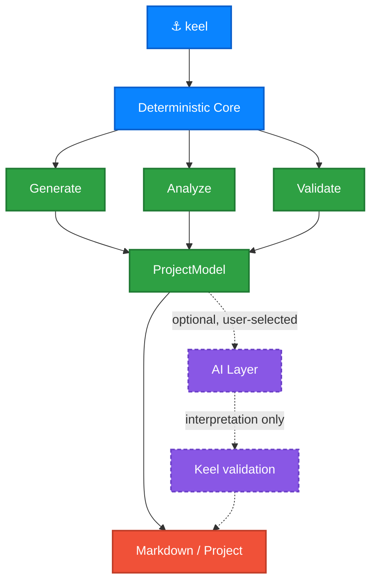

<div align="center">

# ⚓ Keel

### Create, understand, and maintain iOS projects from the terminal.

[](https://github.com/GRimAce11/Keel/actions)
[](https://swift.org)
[](https://developer.apple.com)
[](https://developer.apple.com)
[](LICENSE)

<samp>**No dependencies · Works offline · AI optional, never automatic**</samp>

</div>

---

> [!NOTE]
> **Early development.** Every command listed below works. The API is not
> stable yet, and rules may be added to `keel check` — see the
> [roadmap](#-roadmap).

<br>

## ⚡ What it looks like

<div align="center">
  
</div>

<br>

## 🧭 Why Keel

Most iOS project templates are a folder you clone and immediately start
deleting from. Keel asks what you actually want and writes only that — a
project generated without networking contains no `APIClient.swift` to remove.

It then keeps working *after* the first commit: reading an existing project,
explaining its architecture, and validating it against its own rules.

<table>
<tr>
<td width="50%" valign="top">

#### 🔌 No dependencies
Not in Keel, and not in what it generates. No Alamofire, no Firebase, no DI
framework. `URLSession` and `async/await` are enough now, and a dependency you
never add is one you never migrate.

</td>
<td width="50%" valign="top">

#### 📴 Works offline
Templates are compiled into the binary, never fetched. Generation is
reproducible for a given Keel version and cannot fail on a network hiccup.

</td>
</tr>
<tr>
<td width="50%" valign="top">

#### 🤖 AI is optional
Every core command is deterministic. Keel works with no agent installed, no
account, no API key, and no network.

</td>
<td width="50%" valign="top">

#### 🔒 AI is never silent
Keel may *detect* installed agents, but never invokes one because it happens to
exist. Selection is always explicit; the default is always Keel alone.

</td>
</tr>
</table>

<br>

## 🏛 Architecture

Deterministic analysis is the foundation. An AI layer may *interpret* those
facts — it may never override them.



<br>

## 📟 Commands

| | Command | What it does | Status |
|:--:|---|---|:--:|
| 🆕 | `keel new` | Create a new iOS project | ✅ Working |
| ➕ | `keel add feature` | Generate a feature into an existing project | ✅ Working |
| 📄 | `keel document` | Generate `PROJECT.md` from an existing project | ✅ Working |
| 🔍 | `keel inspect` | Report targets, schemes, dependencies, architecture | ✅ Working |
| ✅ | `keel check` | Validate a project against its architecture rules | ✅ Working |
| 🩺 | `keel doctor` | Diagnose the toolchain and project | ✅ Working |
| 🤖 | `keel ai` | Inspect and choose which local AI agent Keel may use | ✅ Working |

<br>

## 📦 Components

`keel new` asks about each of these independently. Say no and the files are
never written.

| Component | What you get |
|---|---|
| **Networking** | `APIClient`, endpoints, typed errors, retry and auth headers |
| **Dependency injection** | `AppContainer` composition root with constructor injection |
| **Persistence** | SwiftData model container and a store protocol |
| **Authentication** | Token storage, refresh, and sign-out on 401 |
| **Keychain storage** | Secure storage wrapping the Keychain API |
| **Localization** | String Catalog and typed accessors |
| **Unit tests** | Test target with stubs and ViewModel tests |
| **Design system** | Spacing, colour and typography tokens |
| **Example feature** | A working list + detail screen you can copy |

> [!TIP]
> Components that depend on others resolve automatically. `--no-networking`
> also drops authentication and the example feature — and says so, rather than
> emitting a project that does not compile.

<br>

## 🔒 Privacy

Keel reads your project and writes files. It sends nothing anywhere, with one
exception you have to ask for twice.

| | |
|---|---|
| **Network access** | None, ever, except an agent you selected running under `--ai` |
| **Telemetry** | None |
| **Accounts or keys** | None. Keel has no account and reads no API key |
| **Core commands** | `new`, `inspect`, `document`, `check`, `doctor`, `add` are fully offline |

When you do ask for `--ai`, what leaves the machine is **the analysis, not your
code**: the same derived facts `PROJECT.md` already prints — counts,
conformances, folder and type names, the evidence behind each verdict. There is
a test asserting that a secret in your source cannot reach the prompt, because
Keel records that a type exists, never what a string literal contains.

`keel document --show-prompt` prints the whole thing without sending it, so you
never have to take that on trust.

> [!IMPORTANT]
> Keel detects installed agents by reading `PATH`. It does not run them — not
> even for a version string. Detection, selection and invocation are three
> separate acts, and `keel document --no-ai` overrides all of them.

<br>

## 🚀 Install

```bash
brew install GRimAce11/tap/keel
```

<sub>From Keel's own tap — `GRimAce11/tap` is the tap, `keel` is the formula, and no
separate <code>brew tap</code> step is needed. Plain <code>brew install keel</code>
will not find it.</sub>

<details>
<summary><b>From source</b></summary>

<br>

```bash
git clone https://github.com/GRimAce11/Keel.git
cd Keel
swift build -c release
cp .build/release/keel /usr/local/bin/
```

</details>

<sub>Requires macOS 13+. Building from source needs Xcode 16.3 or newer, for
Swift 6.1. Keel ships from its own tap rather than homebrew-core, which requires
a self-submitted project to have 225 stars, 90 forks or 90 watchers. A tap is
what Homebrew's own policy recommends until then.</sub>

<br>

## ⚙️ Usage

```bash
keel new MyApp                        # ask about each component
keel new MyApp --yes                  # take every default, for CI
keel new MyApp --minimal              # app skeleton only
keel new MyApp --no-networking        # skip one component
keel new MyApp --bundle-id com.acme --ios 18.0
```

### Adding to an existing project

```bash
keel add feature Profile
```

```text
Features/Profile/
├── Data/Profile Repository.swift
├── Domain/Profile.swift
└── Presentation/ProfileView.swift, ProfileViewModel.swift
ProbeTests/Features/ProfileTests.swift
```

**The project decides the shape, not Keel.** Where features live, and which
infrastructure exists, are read from the project before anything is written — so
a project generated without networking gets a repository with no networking in
it and a comment saying why, rather than a stack it never asked for. A project
with no test target gets no test file.

Generated features pass `keel check`, and a test asserts it.

### Reading an existing project

```bash
cd SomeApp
keel inspect          # targets, schemes, dependencies, source, architecture
keel inspect --json   # the same, as JSON
```

Everything reported is read from the project's own files — no `xcodebuild`, no
network, no AI. It works on a project that does not currently compile, which is
often exactly when you need to understand it.

The last section names the architecture — MVVM or not, feature-based or
layered, `@Observable` or `ObservableObject`, where dependencies come from —
and shows the counts behind each conclusion. Every finding also says whether it
came from the code or from what someone named a folder, because those are not
the same claim:

```
Architecture
  SwiftUI MVVM, organised by feature, wired through a composition root,
  built on @Observable, async/await and SwiftData.
  Counted from the app's own source; test targets are left out.

  Presentation    MVVM              from the code
                  6 SwiftUI views declared.
                  2 types named with a ViewModel suffix.
                  2 of those are @Observable or an ObservableObject.
  Organisation    Feature-based     from naming
                  1 feature folder found.
```

Where the evidence settles nothing, the answer is `Undetermined` rather than
the likeliest guess.

### Writing it down

```bash
keel document              # write PROJECT.md into the project
keel document --stdout     # print it instead
keel document -o docs/Architecture.md
```

`PROJECT.md` holds the same facts `inspect` prints — structure, targets,
dependencies, architecture — as Markdown, with the evidence behind each
conclusion in a collapsible section. It is built from the same `ProjectModel`,
so the two cannot disagree about a project.

The output is deterministic: no timestamp, nothing that changes between runs
unless the project changed. Re-running on an unchanged project produces an
empty diff, which is what makes it safe to commit and regenerate.

Because it is safe to commit, it can go stale — so it can be checked:

```bash
keel document --check    # writes nothing, exits non-zero when out of date
```

```text
✗ PROJECT.md is out of date.

  Added feature Settings
  Added package dependency Alamofire

  Run `keel document` to bring it up to date.
```

It names what changed rather than only that something did, because a Markdown
diff can say lines moved but not that a feature was added. Each document carries
a small record of the project it described, in an HTML comment that renders to
nothing. A document written by hand has no such record, and `--check` says it
cannot tell rather than guessing.

Drop it in CI next to your tests and documentation stops drifting.

`PROJECT.md` also carries a section written for whoever picks the project up
next — often a coding agent: the architecture rules the project follows, its
conventions, what not to do, where to start reading, and the commands to build
and test it.

Every rule describes what the project **already does**. If some view models are
not `@MainActor`, Keel does not print "view models are `@MainActor`" — a rule
nobody follows is worse than no rule, because the next person follows it into
the inconsistency. The prohibitions are exactly the rules `keel check` enforces,
so following the document and passing the checker cannot come apart.

> [!NOTE]
> Keel replaces its own `PROJECT.md` without asking, and refuses to replace one
> it did not write. Pass `--force` if you mean it.

### Choosing an AI agent

```bash
keel ai                 # what is installed, and what is selected
keel ai use claude      # permit one — this does not run it
keel ai verify          # run it once, to prove Keel can reach it
keel ai forget          # back to Keel alone
```

Detection reads `PATH` and nothing else. It does not shell out to `which`, and
it does not run the agent — not even for a version string. Keel is allowed to
notice an agent exists; running one is a separate act.

`keel ai verify` is the only command in Keel that invokes an agent. It sends one
fixed, trivial prompt, prints the command before running it, and reads no
project and sends no code.

Your choice lives in `~/.config/keel/ai.json` as plain JSON, including the exact
command line:

```json
{ "agentID": "claude", "command": "claude", "arguments": ["-p", "{prompt}"] }
```

That file is the single source for what Keel *says* it will run and what it
*does* run, so the two cannot disagree. The shipped invocations are Keel's best
current understanding of each CLI, not a promise — when an agent changes its
flags, edit this file rather than waiting for a Keel release.

> [!IMPORTANT]
> An installed agent is not a selected one, and a selected one still only runs
> when a command you typed asks it to. No core command uses an agent at all.

Selecting an agent permits it; it does not schedule it. When it may actually run
is a separate setting:

```bash
keel ai mode never    # default — Keel alone unless --ai is passed
keel ai mode ask      # Keel asks first, when someone is there to answer
keel ai mode always   # Keel goes ahead
```

A repository can lower this through `.keel/config.json`, and can never raise it:

```json
{ "ai": { "mode": "never" } }
```

Cloning someone's project must not hand their configuration permission to run an
agent on your machine, so the more restrictive of the two settings always wins —
and `keel ai` tells you when a project is the reason.

`keel document --no-ai` is absolute. It overrides the mode, the project config
and anything else: no provider, no external process, no network. It is the flag
you reach for when you need to be certain, and a guarantee with an exception
would not be one.

### Letting an agent interpret the facts

```bash
keel document --show-prompt   # exactly what would be sent, sending nothing
keel document --ai            # add an overview written by your agent
```

**The agent returns data; Keel writes the Markdown.** It fills named fields —
overview, data flow, conventions, risks, where to start — and Keel renders every
heading around them. That ordering is the point: if the agent authored the
document, every guarantee about structure and attribution would hold only as
long as it followed instructions. Replies are validated before anything is
rendered, so Markdown an agent injects into a field is stripped rather than
opening a section that looks measured.

Everything else in `PROJECT.md` is byte-for-byte what it would be without the
flag — the interpretation lives inside its own fence, is attributed, and says
Keel checked its shape and not its claims.

**Keel sends the facts, not your code.** The prompt contains the same derived
findings the document already prints: counts, conformances, folder names,
evidence. No source ever leaves the machine, and `--show-prompt` shows you the
whole thing before you commit to sending it.

If the agent fails — no quota, no network, wrong flags — you get the document
anyway, with a warning and no overview. Losing a report because a bonus
paragraph failed would be a poor trade.

### Validating and diagnosing

```bash
keel check            # findings, exits non-zero on errors
keel check --strict   # warnings fail too, for CI
keel check --json
keel doctor           # can this machine build what Keel generates?
```

`check` separates what it is *sure* of from what it *suspects*, and the split is
the point:

| | |
|---|---|
| **error** | Structural, with a definite consequence. A `@Model` type in a file that does not import SwiftData; a scheme under `xcuserdata` that CI cannot see. |
| **warning** | Rests on a naming convention, or on something syntax cannot fully see. A `*ViewModel` that is not `@MainActor` — which may inherit isolation Keel cannot follow, and the finding says so. |

Only errors fail the command by default. A checker that failed builds over a
naming convention would be turned off within a week, so a convention never gets
to be an error.

Keel's own generated projects pass every rule, and a test asserts it — shipping a
generator whose output fails its own checker would make the checker impossible
to take seriously.

<details>
<summary><b>All options</b></summary>

<br>

| Option | Effect |
|---|---|
| `--bundle-id <prefix>` | Bundle identifier prefix. The project slug is appended. |
| `--ios <version>` | Minimum iOS version. Defaults to `17.0`. |
| `-y, --yes` | Accept every default without asking. |
| `--minimal` | App skeleton only — no optional components. |
| `--no-networking` | Skip the networking layer. |
| `--no-dependency-injection` | Skip the DI container. |
| `--no-persistence` | Skip persistence. |
| `--no-authentication` | Skip authentication. |
| `--no-keychain` | Skip Keychain storage. |
| `--no-localization` | Skip localization. |
| `--no-testing` | Skip the unit test target. |
| `--no-design-system` | Skip the design system. |
| `--no-example-feature` | Skip the example feature. |

Names are normalised rather than rejected: `keel new "my cool app"` produces
`MyCoolApp` with the bundle slug `my-cool-app`. Swift keywords and names
starting with a digit are caught before anything is written.

</details>

<br>

## 💡 Examples

**Starting something new**

```bash
keel new Bookshelf --yes
cd Bookshelf
open Bookshelf.xcodeproj          # builds and runs as generated
keel add feature Library          # a second feature, shaped like the first
```

**Picking up a project you did not write**

```bash
cd InheritedApp
keel doctor      # can this machine even build it?
keel inspect     # targets, structure, and the architecture it implies
keel check       # what is already wrong with it
keel document    # PROJECT.md, to read on the train
```

Everything there works on a project that does not currently compile — which is
usually the state an inherited project is in.

**Keeping it honest in CI**

```yaml
- run: keel check --strict          # fails on warnings too
- run: keel document --check        # fails when PROJECT.md has drifted
```

Neither touches the network, needs an account, or invokes an agent.

<br>

## 🗺 Roadmap

<details>
<summary><b>Phase plan</b></summary>

<br>

| | Phase | |
|:--:|---|:--:|
| ✅ | CLI foundation | done |
| ✅ | Project configuration model | done |
| ✅ | Interactive `keel new` | done |
| ✅ | Template system | done |
| ✅ | Xcode project generation | done |
| ✅ | Generated MVVM architecture | done |
| ✅ | Conditional infrastructure modules | done |
| ✅ | Example feature | done |
| ✅ | `keel inspect` | done |
| ✅ | ProjectModel | done |
| ✅ | Swift source analysis | done |
| ✅ | Architecture detection | done |
| ✅ | `keel document` without AI | done |
| ✅ | AI agent detection & provider abstraction | done |
| ✅ | AI-assisted documentation | done |
| ✅ | `keel check` and `keel doctor` | done |
| ✅ | Homebrew distribution | done |
| ✅ | `keel add feature` | done |

</details>

<br>

## 🤝 Contributing

Read [CONTRIBUTING.md](CONTRIBUTING.md) first — it lists the few things Keel
refuses on principle (third-party dependencies, AI in a core command), so
nobody builds something that was never going to land.

```bash
swift build
swift test                      # Keel's own tests
./Scripts/verify-generated.sh   # generates and builds every combination
```

The last one is required for any template change. Unit tests prove the right
files were written; only a real build proves the result opens in Xcode.

<br>

## 📄 License

MIT — the code Keel generates is yours, with no attribution required.

<div align="center">
<br>
<sub>Built by <a href="https://github.com/GRimAce11">Chethan Nayak</a></sub>
</div>
