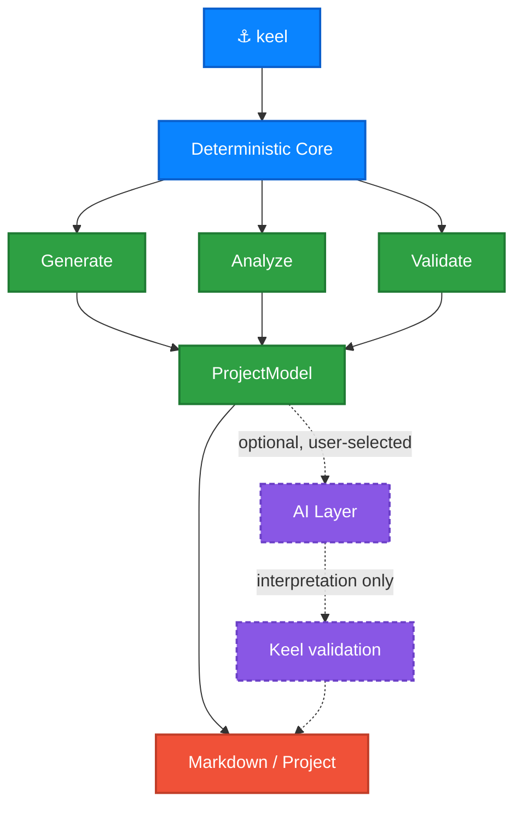

# Keel — reference

Everything the [README](README.md) deliberately leaves out: how each verdict
is reached, what `keel check` will and will not call an error, what an agent
is allowed to add, and where Keel's answers stop.

---

## Reading a project

### What `explore` will and will not do

```text
Probe
  Swift files   43
  Types         62
  Features      2
  Targets       2

  SwiftUI MVVM, screens fed both ways, organised by feature, wired through a
  composition root, built on @Observable, async/await and SwiftData.

    1. Architecture      5. Types by role
    2. Features          6. Architecture warnings
    3. Dependencies      7. Search
    4. Data flow         8. Exit
```

Everything it shows is the same facts `inspect` and `check` report, reachable
without knowing which flag produces them. Pick a type and it shows what it refers
to and what refers back.

Where the graph cannot establish something, it says **"Undetermined from static
analysis"** rather than offering the likeliest shape.

**It never invokes an agent**, and it works on a project that does not compile —
the state an inherited project is usually in. Piped or redirected it prints the
summary and stops, rather than waiting for somebody who is not there.

### How the architecture verdict is reached

The last section of `keel inspect` names the architecture — MVVM or not,
feature-based or layered, what the screens actually hold, which way dependencies
run — and shows what each conclusion rests on:

```
Architecture
  SwiftUI MVVM, screens fed both ways, organised by feature, wired through a
  composition root, built on @Observable, async/await and SwiftData.
  Some screens go through view models and some reach the data layer directly.
  Dependencies run from features towards shared code.

  Presentation      MVVM                   from relationships
                    6 SwiftUI views declared.
                    2 types named with a ViewModel suffix.
                    2 of those are @Observable or an ObservableObject.
                    2 views refer to one, in 4 places.
                      Probe/Features/Articles/Presentation/ArticleListView.swift:10 …
  Screen data       Mixed                  from relationships
                    4 references from a view to a view model.
                    3 references from a view straight to a repository or client.
  Organisation      Feature-based          from naming
                    1 feature folder found.
  Layer boundaries  Respected              from relationships
  Wiring            Composition root       from relationships
                    AppContainer constructs 3 types that other types take as
                    initializer parameters.
```

Every finding says which of **three** kinds of evidence got it there, because
they are not the same claim. `from relationships` outranks `from the code`,
which outranks `from naming`. A type *called* `ArticleViewModel` is a naming
habit; a type that is `@Observable` is a declaration; a view that actually
*holds* one is a relationship — and only the last of those is evidence that the
project is built the way the diagram says.

The rule is mechanical rather than per-finding: **a conclusion resting only on
names can never be reported as coming from the code**, whatever it concludes.
Evidence that undercuts a verdict is printed and not counted as support, and
evidence that merely sets the scene — how many views exist, when the question is
where their state lives — is counted as neither.

Nothing is inferred from a name where a relationship can answer instead. A
composition root is a type that *builds* the app's services, not a type called
`*Container`; a project can be full of view models and still have every view
holding its own repository, and Keel reports that rather than the name.

Where the evidence settles nothing, the answer is `Undetermined` rather than the
likeliest guess.

### What depends on what

#### Imports

```bash
keel inspect --dependencies
```

```text
Articles
  → Foundation  system   6 files
  → SwiftUI     system   2 files

ProbeTests
  → Probe       project  6 files
  → Testing     system   5 files
```

Every edge knows the file and line that declared it, so a dependency is
checkable rather than asserted. Packages are matched against the product names
the project actually links — `socket.io-client-swift` vends `SocketIO`, and
matching the package name would miss it. Anything Keel cannot place is `unknown`
rather than assumed to be Apple's, because an optimistic default would quietly
relabel every in-house framework as a system one.

Import cycles are reported and not failed. A cycle between modules is usually a
problem and occasionally deliberate.

> [!NOTE]
> Imports only cross *module* boundaries. In a single-target app every feature
> compiles into the same module, so one feature using another's types produces
> no import at all. Keel says so rather than letting silence read as "nothing
> depends on this".

#### Type references

Imports stop at the module boundary. Type references do not — so this is the
report that can see inside a single-target app, where almost every iOS project
lives.

```bash
keel inspect --relationships
```

```text
Presentation relationships (27)
  ArticleListView
    → ArticleListViewModel       property  2 mentions
    → ArticleRepositoryProtocol  property  2 mentions
    → ArticleDetailView          constructs

Worth a look (2)
  ArticleListView → ArticleRepositoryProtocol  from naming
    A view reaches a repository directly
    Probe/Features/Articles/Presentation/ArticleListView.swift:11  property
```

Every edge is parsed, not matched: a superclass is told apart from a protocol
conformance, an initializer parameter from any other parameter, a declared
property from a mention in a method body. Each one carries the file and line
that wrote it.

A name that matches nothing the project declares is left out rather than
reported weakly, and a name two types share is marked as a name match instead of
a resolution. Roles work the same way — a type conforming to `View` is a view
*from the code*, a type called `ArticleRepository` is a repository *from
naming*, and a finding is only ever as strong as its weaker end.

> [!NOTE]
> These are references written in source, at lines you can open. Not a call
> graph: Keel does not claim any of them runs, or in what order.

#### Both at once

Imports and type references answer the same question at different reaches, and
each is blind exactly where the other looks — an import cannot cross into a
single module, a type reference cannot see a package. Joined, they answer at
whichever size you asked.

```bash
keel inspect --graph          # target, module, feature and layer scopes
keel inspect --graph --json   # the same graph, as JSON
```

```text
Feature dependencies
  Articles
    └── Settings  1 link  Probe/Features/Articles/Presentation/ArticleListViewModel.swift:13
  Settings
    └── Articles  1 link  Probe/Features/Settings/Presentation/SettingsViewModel.swift:13

Cycles
  feature  Articles → Settings → Articles

Against the grain (1)
  Core → Articles
    Shared code depends on a feature, so it cannot be used without it.
    Probe/Core/Utilities/AppLogger.swift:14  AppLogger → Article  property
```

Every edge unfolds back into the lines that produced it, so a coarse answer
stays checkable.

**Cycles need no rule to be wrong**, so they are reported wherever they appear
in the architecture. **Directions do** — and the only thing a project layout
establishes is that `Core` and `Shared` exist to be used by features, so
depending the other way makes them unusable without that feature. One feature
using another is reported as an edge and left to be judged, because nothing here
says which way that one should run.

> [!NOTE]
> Cycles are only reported at target, module, feature and layer scope. A loop
> between *types* is ordinary Swift — a protocol and the type conforming to it
> name each other in every codebase — and flagging that would teach you to
> ignore the section carrying the real ones.

---

## PROJECT.md

`--check` names what changed rather than only that something did, because a
Markdown diff can say lines moved but not that a feature was added. Coupling
counts as a change worth regenerating for; reference *counts* deliberately do
not, since those move on every ordinary edit and would leave every document
permanently stale.

Each document carries a small record of the project it described, in an HTML
comment that renders to nothing. A document written by hand has no such record,
and `--check` says it cannot tell rather than guessing.

`PROJECT.md` also carries a section written for whoever picks the project up
next — often a coding agent: the architecture rules the project follows, its
conventions, what not to do, where to start reading, and the commands to build
and test it.

Every rule describes what the project **already does**. If some view models are
not `@MainActor`, Keel does not print "view models are `@MainActor`" — a rule
nobody follows is worse than no rule, because the next person follows it into
the inconsistency. The prohibitions are exactly the rules `keel check` enforces,
so following the document and passing the checker cannot come apart.

> [!NOTE]
> Keel replaces its own `PROJECT.md` without asking, and refuses to replace one
> it did not write. Pass `--force` if you mean it.

---

## Validating

```bash
keel check                # findings, exits non-zero on errors
keel check --strict       # warnings fail too, for CI
keel check --explain      # why each finding exists, and why it has that severity
keel check --interactive  # walk the findings one at a time
keel check --json
keel doctor               # can this machine build what Keel generates?
```

`check` validates real architecture boundaries, not just declarations. It reads
the same relationship graphs `inspect` does, so it can report a screen holding a
networking client, a feature cycle, shared code depending on a feature, or a
layer pointing back outwards — each with the lines it was read from:

```text
✗ Probe/Features/Articles/Presentation/StoredItemView.swift:4 —
  StoredItemView refers to a persistence type, StoredItem, directly.
  Evidence:
    Probe/Features/Articles/Presentation/StoredItemView.swift:5  property: StoredItem

! Articles → Settings → Articles is a dependency cycle.
  Path: Articles → Settings → Articles
  Evidence:
    …/ArticleListViewModel.swift:13  Articles → Settings: ArticleListViewModel → SettingsViewModel
    …/SettingsViewModel.swift:13     Settings → Articles: SettingsViewModel → Article
```

`check` separates what it is *sure* of from what it *suspects*, and the split is
the point:

| | |
|---|---|
| **error** | Structural, with a definite consequence. A `@Model` type in a file that does not import SwiftData; a scheme under `xcuserdata` that CI cannot see; a SwiftUI `View` holding an `@Model` type — where both ends are attributes and conformances, not names. |
| **warning** | Rests on a naming convention, or on something syntax cannot fully see. A `*ViewModel` that is not `@MainActor` — which may inherit isolation Keel cannot follow, and the finding says so. |

**Severity is derived from the evidence, not fixed per rule.** The same rule
produces an error when both ends of a relationship are established by the code
and a warning the moment a name is load-bearing: `ProfileView` holding a `@Model`
type is certain, `ProfileView` holding an `ArticleRepository` rests on a suffix.
Only errors fail the command by default. A checker that failed builds over a
naming convention would be turned off within a week, so a convention never gets
to be an error.

That is also why a **feature cycle is a warning**. A cycle needs no rule to be
wrong, but what counts as a feature comes from folder names — so the grouping is
conventional even though the references are not.

`--explain` prints why each rule exists and why the finding carries the severity
it does. `--interactive` walks the findings one at a time, offering evidence, the
dependency path, and the rule's rationale; it changes nothing about the exit
code, and falls through to the plain report when there is no terminal, so a stray
flag in CI never waits for somebody who is not there.

### Adopting it on a codebase that already fails

```bash
keel check --write-baseline    # record today's findings as accepted
keel check                     # .keel/baseline.json is used when present
keel check --no-baseline       # report everything again
```

The baseline is found, not configured: a project either has
`.keel/baseline.json` or it does not.

Findings are matched on **rule and file, never on the line**. Line numbers move
on every unrelated edit, and a baseline keyed on them goes stale the first time
somebody adds an import — the same reason `document --check` leaves reference
counts out of its fingerprint. The recorded count matters, though: a sixteenth
finding in a file that had fifteen is a new one.

Accepted findings are counted, never silently dropped — a suppressed finding
nobody can see is a lie about the state of the project. And a baseline entry
that no longer matches is reported as fixed and **does not fail**; punishing
somebody for fixing something is how a tool gets switched off.

Keel's own generated projects pass every rule, and a test asserts it — shipping a
generator whose output fails its own checker would make the checker impossible to
take seriously.

---

## Creating a project

```bash
keel new MyApp                        # ask about each component
keel new MyApp --yes                  # take every default, for CI
keel new MyApp --minimal              # app skeleton only
keel new MyApp --no-networking        # skip one component
keel new MyApp --bundle-id com.acme --ios 18.0
```

It opens and builds in Xcode as generated, and passes `keel check`.

`keel new` asks about each component independently. **Say no and the files are
never written** — a project without networking contains no `APIClient.swift` to
delete.

| Component | What you get |
|---|---|
| **Networking** | `APIClient`, endpoints, typed errors, retry and auth headers |
| **Dependency injection** | `AppContainer` composition root with constructor injection |
| **Persistence** | SwiftData model container and a store protocol |
| **Authentication** | Token storage, refresh, and sign-out on 401 |
| **Keychain storage** | Secure storage wrapping the Keychain API |
| **Localization** | String Catalog and typed accessors |
| **Unit tests** | Test target with stubs and ViewModel tests |
| **Design system** | Spacing, colour and typography tokens |
| **Example feature** | A working list + detail screen you can copy |

> [!TIP]
> Components that depend on others resolve automatically. `--no-networking` also
> drops authentication and the example feature — and says so, rather than
> emitting a project that does not compile.

Adding to a project later:

```bash
keel add feature Profile
```

```text
Features/Profile/
├── Data/ProfileRepository.swift
├── Domain/Profile.swift
└── Presentation/ProfileView.swift, ProfileViewModel.swift
ProbeTests/Features/ProfileTests.swift
```

**The project decides the shape, not Keel.** Where features live, and which
infrastructure exists, are read from the project before anything is written — so
a project generated without networking gets a repository with no networking in it
and a comment saying why, rather than a stack it never asked for. A project with
no test target gets no test file.

Generated features pass `keel check`, and a test asserts it.

### All `keel new` options

| Option | Effect |
|---|---|
| `--bundle-id <prefix>` | Bundle identifier prefix. The project slug is appended. |
| `--ios <version>` | Minimum iOS version. Defaults to `17.0`. |
| `-y, --yes` | Accept every default without asking. |
| `--minimal` | App skeleton only — no optional components. |
| `--no-networking` | Skip the networking layer. |
| `--no-dependency-injection` | Skip the DI container. |
| `--no-persistence` | Skip persistence. |
| `--no-authentication` | Skip authentication. |
| `--no-keychain` | Skip Keychain storage. |
| `--no-localization` | Skip localization. |
| `--no-testing` | Skip the unit test target. |
| `--no-design-system` | Skip the design system. |
| `--no-example-feature` | Skip the example feature. |

Names are normalised rather than rejected: `keel new "my cool app"` produces
`MyCoolApp` with the bundle slug `my-cool-app`. Swift keywords and names starting
with a digit are caught before anything is written.

---

## The AI layer

### Choosing an agent, and when Keel may run it

```bash
keel ai                 # what is installed, and what is selected
keel ai use claude      # permit one — this does not run it
keel ai verify          # run it once, to prove Keel can reach it
keel ai forget          # back to Keel alone
```

Detection reads `PATH` and nothing else. It does not shell out to `which`, and it
does not run the agent — not even for a version string. Keel is allowed to notice
an agent exists; running one is a separate act.

`keel ai verify` is the only command in Keel that invokes an agent. It sends one
fixed, trivial prompt, prints the command before running it, and reads no project
and sends no code.

Your choice lives in `~/.config/keel/ai.json` as plain JSON, including the exact
command line:

```json
{ "agentID": "claude", "command": "claude", "arguments": ["-p", "{prompt}"] }
```

That file is the single source for what Keel *says* it will run and what it
*does* run, so the two cannot disagree. The shipped invocations are Keel's best
current understanding of each CLI, not a promise — when an agent changes its
flags, edit this file rather than waiting for a Keel release.

> [!IMPORTANT]
> An installed agent is not a selected one, and a selected one still only runs
> when a command you typed asks it to. No core command uses an agent at all.

Selecting an agent permits it; it does not schedule it. When it may actually run
is a separate setting:

```bash
keel ai mode never    # default — Keel alone unless --ai is passed
keel ai mode ask      # Keel asks first, when someone is there to answer
keel ai mode always   # Keel goes ahead
```

A repository can lower this through `.keel/config.json`, and can never raise it:

```json
{ "ai": { "mode": "never" } }
```

Cloning someone's project must not hand their configuration permission to run an
agent on your machine, so the more restrictive of the two settings always wins —
and `keel ai` tells you when a project is the reason.

`keel document --no-ai` is absolute. It overrides the mode, the project config and
anything else: no provider, no external process, no network. It is the flag you
reach for when you need to be certain, and a guarantee with an exception would
not be one.

### What an agent is allowed to add

**The agent returns data; Keel writes the Markdown.** It fills named fields —
overview, dependency flow, conventions, boundaries, inconsistencies, risks,
reading order, legacy areas, questions — and Keel renders every heading around
them. That ordering is the point: if the agent authored the document, every
guarantee about structure and attribution would hold only as long as it followed
instructions. Markdown an agent injects into a field is stripped rather than
opening a section that looks measured.

**Observed, inferred and suggested stay apart, and the agent does not get to
choose which is which.** Keel measured the rest of the document; the agent's
reading of it is labelled *inferred*, and its advice is labelled *suggested — not
a rule this project follows*. There is no field an agent can fill that comes out
labelled as observed. "Consider exposing authentication behind an abstraction"
and "authentication is exposed behind an abstraction" are one word apart in a
skim, and only one of them is true of your project.

**A claim naming something that does not exist is dropped.** Every CamelCase name
in a reply is checked against the project's own vocabulary — its types, features,
modules, targets and imports. An agent that invents a `PaymentGateway` loses the
sentence it invented it in, and the rest of the reply survives; an invented name
is exactly what a reader would go looking for.

**The agent is told what Keel already wrote.** Conventions, architecture rules,
prohibitions and anything `keel check` currently reports are sent as exclusions,
so the interpretation adds to the document rather than restating it under a
heading that makes advice look measured.

Everything else in `PROJECT.md` is byte-for-byte what it would be without the
flag — the interpretation lives inside its own fence and is attributed.

If the agent fails — no quota, no network, wrong flags — you get the document
anyway, with a warning and no interpretation. Same if its reply is malformed, or
if nothing in it survives checking. Losing a report because a bonus paragraph
failed would be a poor trade.

---

## What Keel cannot tell you

Stated plainly, because a tool that reports its limits is easier to trust than
one that does not.

**It reads source, not behaviour.** Every relationship is a mention written in a
file, at a line you can open. Keel does not know whether that line runs, how
often, or in what order. Nothing here is a call graph.

**Roles are partly naming.** Keel always says which kind of evidence it had, but
where it only had a name, the limit is real: it cannot recognise a repository
called something that is not `*Repository`, and it cannot tell a well-named type
from one doing something else entirely.

**Ownership comes from folders.** Which feature a file belongs to is read from
the directory layout, because with synchronized folder groups the project file
says nothing about it. A project organised some other way gets `Undetermined`
rather than an invented answer.

**One module is one module.** Imports cannot show coupling inside a single target
— that is what the type graph is for — and type references cannot see inside a
package. Neither can see across a language boundary into Objective-C.

**No build means no compiler.** Working on a project that does not compile is the
point, and the cost is that Keel resolves names the way the language does
*approximately*: a bare name reaches top-level types and nested ones only from
inside their scope. Two types sharing a name resolve to one of them, and the
finding says it was a name match rather than a resolution.

**It has no opinion about your architecture.** It reports what is there. The only
direction it will call wrong is one the project itself establishes — code in
`Core` or `Shared` being depended on *by* features — plus cycles, which need no
rule to be wrong. One feature using another is an edge, not a fault.

---

## How Keel is built

Deterministic analysis is the foundation. An AI layer may *interpret* those
facts — it may never override them.



---

## Building from source

```bash
git clone https://github.com/GRimAce11/Keel.git
cd Keel
swift build -c release
cp .build/release/keel /usr/local/bin/
```

Keel runs on macOS 13+, but **building** it needs Xcode 16.0 or newer, for Swift
6.0 — which is why the Homebrew formula asks for macOS 14. The formula builds
from source, and that build cannot happen on Ventura.

Keel ships from its own tap rather than homebrew-core, which requires a
self-submitted project to have 225 stars, 90 forks or 90 watchers. A tap is what
Homebrew's own policy recommends until then.

---

## Phase plan

| | Phase | |
|:--:|---|:--:|
| ✅ | CLI foundation | done |
| ✅ | Project configuration model | done |
| ✅ | Interactive `keel new` | done |
| ✅ | Template system | done |
| ✅ | Xcode project generation | done |
| ✅ | Generated MVVM architecture | done |
| ✅ | Conditional infrastructure modules | done |
| ✅ | Example feature | done |
| ✅ | `keel inspect` | done |
| ✅ | ProjectModel | done |
| ✅ | Swift source analysis | done |
| ✅ | Architecture detection | done |
| ✅ | `keel document` without AI | done |
| ✅ | AI agent detection & provider abstraction | done |
| ✅ | AI-assisted documentation | done |
| ✅ | `keel check` and `keel doctor` | done |
| ✅ | Homebrew distribution | done |
| ✅ | `keel add feature` | done |
| ✅ | Import graph | done |
| ✅ | Type relationship graph | done |
| ✅ | Unified dependency graph | done |
| ✅ | Relationship-aware architecture | done |
| ✅ | `keel check` against real boundaries | done |
| ✅ | Canonical evidence model | done |
| ✅ | AI interprets relationships | done |
| ✅ | Interactive architecture explorer | done |
| ✅ | Performance and hardening | done |

